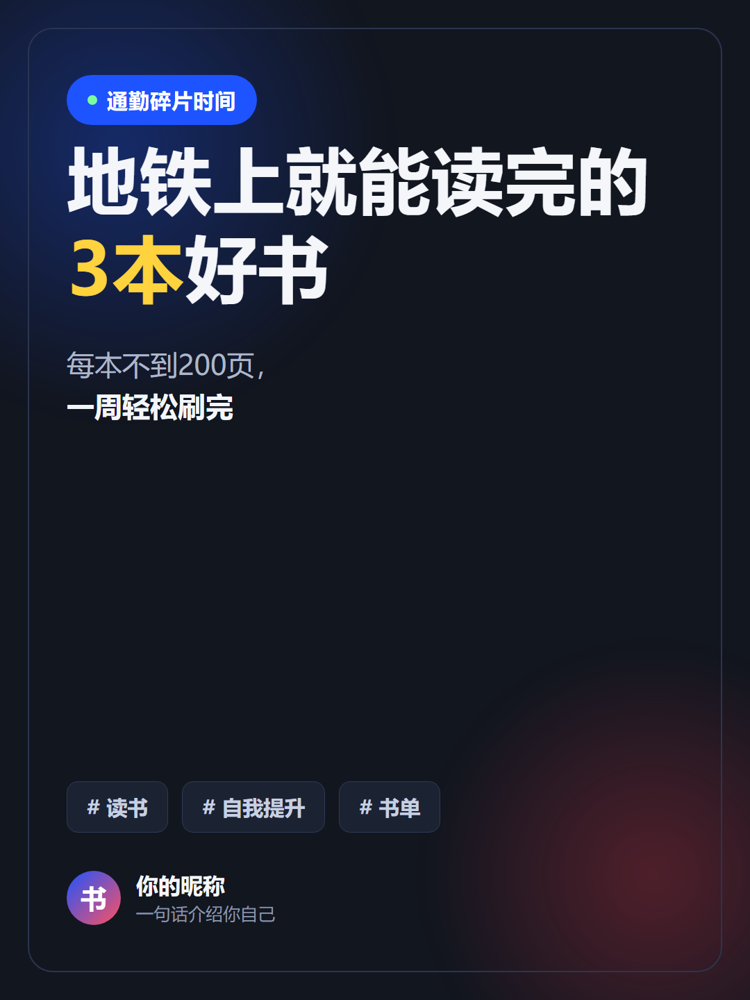
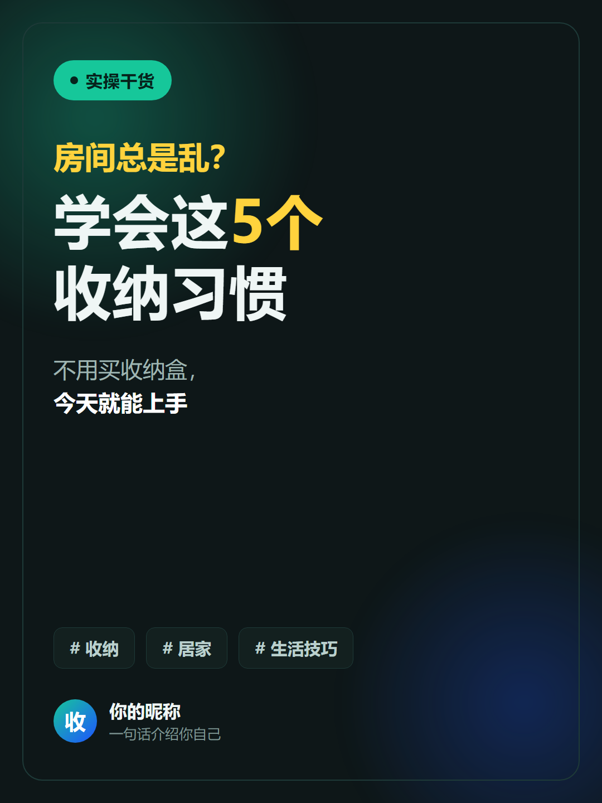
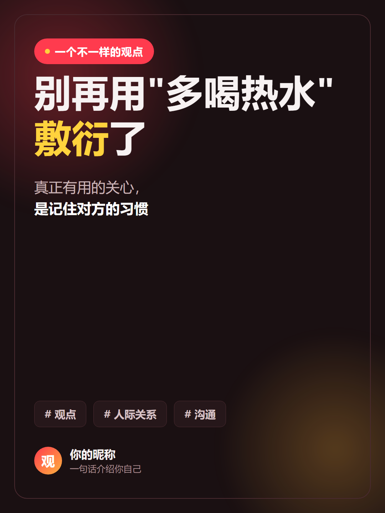

# 📕 XHS Content Master · 小红书内容运营大师

> 把 **方法论 + 出图 + 发布 + 合规** 整合成一条可复用工作流的小红书 Skill。
> 内置**防 AI 托管封号合规模块**，封面按内容类型分主题配色，在白底信息流里「跳」出来。

[](./LICENSE)


### ⚠️ 使用前请先知悉官方治理公告

平台 2026-03-10 发布《关于打击 AI 托管运营账号的治理公告》。
本工具的设计前提是 **「真人主导，AI 提效」**——请务必先读 [`references/compliance-anti-ban.md`](references/compliance-anti-ban.md)。

---

## ✨ 它能做什么

- **🧭 内容方法论**：账号定位、三支柱模型、选题对标、爆款复刻、笔记五元组、关注钩子。
- **🎨 钩子封面渲染**：HTML→PNG（1080×1440），4 套按内容类型区分的主题配色，关键词自动高亮。
- **📤 发布链路**：浏览器真人确认发布，或搭配开源 Cookie 发布器；默认仅自己可见预览。
- **🛡 防封合规模块**：内置红线清单 + 发布前 7 项自查，避免被判 AI 托管而降权/封号。

---

## 🖼 封面效果示例

> 1080×1440px（小红书推荐 3:4）。配色按内容类型区分：知识=蓝 / 干货=绿 / 观点=红 / 清新=白。
> 示例均为通用占位内容，署名处替换成你自己的昵称即可。

| 知识蓝 `blue` | 干货绿 `green` | 观点红 `red` |
|---|---|---|
|  |  |  |

---

## 🚀 安装

### 方式一：Claude Code Plugin（推荐）

```bash
# 添加本仓库为 marketplace
/plugin marketplace add 1925952448-svg/xhs-content-master

# 安装插件
/plugin install xhs-content-master@xhs-content-master
```

### 方式二：一句话安装

跟你的 Agent 说：

> 拉取下面的项目，安装其中的技能：https://github.com/1925952448-svg/xhs-content-master

### 方式三：手动放入 Skills 目录

```bash
git clone https://github.com/1925952448-svg/xhs-content-master.git
```
放到支持 Skills 的客户端目录，例如 Claude：`~/.claude/skills/`。

---

## 🎨 渲染封面

```bash
# 安装依赖（仅需 PyYAML；渲染走系统 Chrome/Edge headless）
pip install -r requirements.txt

# 用示例跑一张
python scripts/render_cover.py demos/sample_blue.md

# 指定主题 + 输出路径
python scripts/render_cover.py note.md -t green -o output/cover.png
```

封面内容写在 Markdown 的 YAML 头部：

```yaml
---
theme: blue            # blue=知识 / green=干货 / red=观点 / light=清新
tag: 通勤碎片时间
title: 地铁上就能读完的\n**3本**好书   # \n 换行，**关键词** 自动高亮
subtitle: 每本不到200页，\n**一周轻松刷完**
chips: ["# 读书", "# 自我提升", "# 书单"]
author: 你的昵称
author_sub: 一句话介绍你自己
---
```

> 完整字段与设计规范见 [`references/cover-system.md`](references/cover-system.md)。
> 找不到浏览器时，用环境变量 `CHROME_PATH` 指定 Chrome/Edge 路径。

---

## 📐 多卡片正文图（可选搭档）

需要把长 Markdown 一键切成「封面 + 多张正文卡片」、或想要更多排版皮肤时，
推荐搭配 [Auto-Redbook-Skills](https://github.com/comeonzhj/Auto-Redbook-Skills)（8 主题 + 4 分页模式）。
**组合建议**：封面用本项目（强钩子、配色分型）＋ 内页用多卡片渲染（快速成图）。

---

## 📤 发布到小红书

提供**内置半自动发布器** `scripts/publish_xhs.py`，合规优先设计——
默认「仅自己可见」，公开前强制真人确认，**不做无人值守全自动**。

```bash
# 安装发布依赖
pip install python-dotenv xhs

# 配置 Cookie（复制后填写，.env 已被 .gitignore 忽略）
cp env.example.txt .env

# 1) dry-run 校验  2) 仅自己可见预览  3) --public 公开（会弹 7 项自查 + 真人键入确认）
python scripts/publish_xhs.py -t "标题" -d "正文" -i cover.png card_1.png --dry-run
python scripts/publish_xhs.py -t "标题" -d "正文" -i cover.png card_1.png
python scripts/publish_xhs.py -t "标题" -d "正文" -i cover.png card_1.png --public
```

- Cookie 写入 `.env`，**切勿提交到 Git**（本仓库 `.gitignore` 已忽略）。
- 默认「仅自己可见」预览，确认无误再 `--public`。
- 频率克制、时间随机，详见合规模块。
- 也可让 Agent 用浏览器真人确认后发布（无需 Cookie），二选一。

---

## 📁 项目结构

```
xhs-content-master/
├── SKILL.md                 # 技能描述（Agent 使用说明）
├── README.md                # 项目文档（你现在看到的）
├── LICENSE                  # MIT
├── requirements.txt         # Python 依赖（PyYAML）
├── env.example.txt          # Cookie 配置示例（复制为 .env）
├── .gitignore               # 已忽略 .env 等隐私文件
├── .claude-plugin/
│   ├── plugin.json
│   └── marketplace.json
├── references/
│   ├── compliance-anti-ban.md   # 防 AI 托管封号合规规范 ★
│   ├── content-method.md        # 内容方法论 SOP
│   └── cover-system.md          # 封面参数与设计规范
├── assets/
│   ├── cover_template.html      # 参数化封面模板
│   └── themes.json              # 主题配色
├── scripts/
│   ├── render_cover.py          # 钩子封面渲染器（HTML→PNG）
│   └── publish_xhs.py           # 半自动发布器（合规优先·真人确认）
├── demos/                       # 示例封面与示例笔记
│   ├── sample_blue.md / .png
│   ├── sample_green.md / .png
│   └── sample_red.md / .png
└── examples/
    └── note-five-elements.md    # 一篇完整笔记的写法示例
```

---

## ⚠️ 注意事项

1. **合规优先**：任何发布/互动动作前先过 [`compliance-anti-ban.md`](references/compliance-anti-ban.md) 红线。
2. **真人主导**：内容基于真实经验，AI 只做提效，不做全自动托管。
3. **Cookie 安全**：不要把 `.env` 提交到 Git 或分享出去。
4. **频率与时间**：单账号每天 1~2 篇、时间随机化，避免触发风控。
5. **图片尺寸**：默认 1080×1440px，符合小红书推荐比例。

---

## 🙏 致谢

本项目在方法论与发布链路上参考并致谢两个开源项目：

- [xiaohongshu-ops-skill](https://github.com/Xiangyu-CAS/xiaohongshu-ops-skill) — 运营方法论框架
- [Auto-Redbook-Skills](https://github.com/comeonzhj/Auto-Redbook-Skills) — 多主题渲染与 Cookie 发布脚本

渲染基于系统 Chrome/Edge 的 headless 截图能力。

---

## 📄 License

MIT License © 2026
